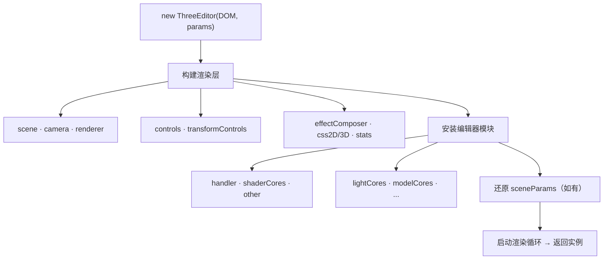

# three-edit-cores API 文档

> 包名 `three-edit-cores` · 版本 `0.0.21`  
> 基于 Three.js 的 3D 场景编辑器核心库 — 传入 DOM 即可获得完整编辑、渲染、存取能力。

| 资源 | 链接 |
|------|------|
| 文档主页 | https://z2586300277.github.io/editor-docs/ |
| 在线案例 | https://z2586300277.github.io/three-editor/dist/#/example |

---

## 目录

1. [快速开始](#1-快速开始)
2. [架构一览](#2-架构一览)
3. [threeEditor 实例速查](#3-threeeditor-实例速查)
4. [实例方法](#4-实例方法)
5. [NPM 导出 API](#5-npm-导出-api)
6. [scene 扩展](#6-scene-扩展)
7. [核心模块 cores](#7-核心模块-cores)
8. [后期 Pass](#8-后期-pass)
9. [场景存取 JSON](#9-场景存取-json)
10. [自定义扩展](#10-自定义扩展)
11. [生命周期钩子](#11-生命周期钩子)
12. [编程控制速查](#12-编程控制速查)
13. [快捷键](#13-快捷键需开启-handleropenkeyenable)
14. [常见问题](#14-常见问题)

---

## 1. 快速开始

```bash
npm install three-edit-cores 
```

```js
import { ThreeEditor } from 'three-edit-cores'

ThreeEditor.dracoPath = '/draco/'   // GLB/GLTF 压缩模型解码路径

const editor = new ThreeEditor(document.getElementById('box'), {
  fps: null,                    // null = 不限帧；数字 = 限帧
  pixelRatio: window.devicePixelRatio,
  webglRenderParams: { antialias: true, alpha: true, logarithmicDepthBuffer: true },
  sceneParams: null             // saveSceneEdit() 导出的 JSON，用于还原场景
})

window.addEventListener('resize', () => editor.renderSceneResize())

document.getElementById('box').addEventListener('dblclick', (e) => {
  editor.getSceneEvent(e, ({ object, rootObject, point }) => {
    console.log(object, point)
  })
})
```

### 静态配置（在 `new` 之前设置）

| 属性 | 说明 |
|------|------|
| `ThreeEditor.dracoPath` | Draco 解码器目录，默认 `'/draco/'`，需把 `draco/` 文件夹放到站点 public 下 |
| `ThreeEditor.styleOverrides` | GUI 浮动面板样式覆盖 |
| `ThreeEditor.__DESIGNS__` | 自定义 3D 组件注册表，`.push(component)` |
| `ThreeEditor.__EFFECTS__` | 自定义后期 Pass 注册表 |
| `ThreeEditor.__GLSLLIB__` | 自定义 GLSL 着色器库 |

---

## 2. 架构一览

### 2.1 创建流程



| 阶段 | 产出（挂到实例上） |
|------|-------------------|
| 构建渲染层 | `scene` `camera` `renderer` `controls` `transformControls` `effectComposer` `css2DRender` `css3DRender` `stats` `DOM` |
| 安装模块 | `handler` `shaderCores` `other` + 8 个 `*Cores` |
| 面板 | `GUI` `openControlPanel()` `panelApi` |
| 生命周期 | `renderSceneResize()` `destroySceneRender()` `saveSceneEdit()` `resetEditorStorage()` |

### 2.2 实例属性树

```
threeEditor
│
├─ 渲染层
│  ├─ scene              扩展 Scene（物体容器 + 环境贴图 + 帧更新）
│  ├─ camera             PerspectiveCamera
│  ├─ renderer           WebGLRenderer（canvas 在 renderer.domElement）
│  ├─ controls           OrbitControls（orbitControls.target = 观察点）
│  ├─ transformControls  变换 gizmo（mode: translate|rotate|scale）
│  ├─ effectComposer     后期管线（effectPass.outlinePass 等）
│  ├─ css2DRender        HTML 标签（始终面向相机）
│  ├─ css3DRender        3D HTML 对象
│  ├─ stats              性能面板
│  └─ DOM                挂载容器
│
├─ 交互
│  ├─ handler            拾取模式 / 撤销 / 辅助线 / 快捷键
│  ├─ getSceneEvent()    点击拾取
│  ├─ setOutlinePass()   轮廓高亮
│  └─ setCss2d/3dDOM()   添加 HTML 标签
│
├─ 内容管理（*Cores → 往 scene 里创建物体）
│  ├─ lightCores         灯光
│  ├─ innerCores         内置几何体
│  ├─ modelCores         外部模型 GLB/FBX/OBJ
│  ├─ drawCores          交互绘制
│  ├─ textCores          3D 文字
│  ├─ particleCores      粒子
│  ├─ designCores        自定义组件
│  └─ geoCores           地理 GeoJSON
│
├─ 扩展
│  ├─ shaderCores        GLSL 着色器库
│  └─ other              动画编辑 / 裁剪 / 视角动画
│
└─ 面板与持久化
   ├─ GUI / openControlPanel()
   ├─ panelApi            编程式子面板
   ├─ saveSceneEdit()     → JSON
   └─ resetEditorStorage(json)
```

### 2.3 每帧渲染顺序

```
requestAnimationFrame
  → [FPS 限帧]
  → stats.update()
  → controls.update()
  → scene.update(t)          // COMMON_UPDATE_LIST 回调
  → css3DRender.render()
  → css2DRender.render()
  → effectComposer.render()  // 或 renderWay='renderer' 时直渲
```

### 2.4 存取流程

```
saveSceneEdit()
  → 收集 scene / camera / renderer / controls / effectComposer
  → 收集 handler / 各 *Cores / other
  → 返回 JSON

resetEditorStorage(json)
  → scene.reset() 清空
  → 按 JSON 逐模块还原
```

---

## 3. threeEditor 实例速查

### 3.1 常用操作对照

| 需求 | 写法 |
|------|------|
| 加物体到场景 | `editor.scene.add(obj)` 或 `editor.scene.attach_add(obj)` |
| 加载模型 | `editor.modelCores.loadModel('model.glb')` |
| 每帧回调 | `editor.scene.addUpdateListener(fn)` |
| 天空盒背景 | `editor.scene.setSceneBackground(urls[6])` |
| 环境光 IBL | `editor.scene.setEnvBackground(urls)` + `environmentEnabled = true` |
| 轮廓高亮 | `editor.setOutlinePass([mesh])` |
| 泛光 | `editor.effectComposer.effectPass.unrealBloomPass.enabled = true` |
| 截图 | `editor.getSceneEditorImage()` |
| 保存 / 加载 | `saveSceneEdit()` / `resetEditorStorage(json)` |
| 打开 GUI | `editor.openControlPanel()` |
| 撤销 / 重做变换 | `restoreHistoryHandler(editor.handler.handlerHistory, 'z')` |
| 播放模型动画 | `editor.modelCores.modelAnimationPlay(group, params)` |
| 显示性能面板 | `editor.stats.showStats = true` |
| 移动 Stats 位置 | `editor.stats.setOffset(top, left)` |
| 销毁后重建 | 必须 `new ThreeEditor()` 新实例，旧实例不可复用 |
| 按类型筛物体 | `scene.children.filter(o => o.editorType === 'isModelGroup')` |

### 3.2 初始化参数

| 参数 | 类型 | 默认 | 说明 |
|------|------|------|------|
| `fps` | `number\|null` | `null` | 限帧，null 不限 |
| `pixelRatio` | `number` | `devicePixelRatio` | 渲染像素比 |
| `webglRenderParams` | `object` | 抗锯齿+透明+对数深度 | WebGLRenderer 构造参数 |
| `sceneParams` | `object\|null` | `null` | 场景 JSON |

### 3.3 渲染层属性要点

**scene**（`createScene()` 扩展）

| 属性 / 方法 | 说明 |
|-------------|------|
| `raycaster` | 场景共享射线 |
| `COMMON_UPDATE_LIST` | 帧更新回调队列 |
| `environmentEnabled` | 开关 IBL 环境贴图 |
| `envBackground` / `envBackgroundUrls` | 环境 CubeTexture |
| `backgroundUrls` | 天空盒 URL |
| `shaderLibrary` | 着色器库（shaderCores 注入） |
| `attach_add(obj)` | add + attach 变换器 |
| `addUpdateListener(fn)` | 注册帧回调 |
| `reset()` | 清空场景 |

**renderer**

| 属性 / 方法 | 说明 |
|-------------|------|
| `domElement` | WebGL canvas |
| `renderListCompare[]` | `{ name, fn, enabled }` 渲染步骤开关 |
| `refreshRenderList()` | 刷新渲染序列 |

**effectComposer**

| 属性 / 方法 | 说明 |
|-------------|------|
| `effectPass` | 所有 Pass 对象映射 |
| `renderWay` | `'effectComposer'`（默认）或 `'renderer'`（直渲） |
| `effectUpdate()` | 执行后期渲染 |

### 3.4 handler 属性

| 属性 | 默认 | 说明 |
|------|------|------|
| `mode` | `'transform'` | `'transform'` attach 变换器 / `'select'` 轮廓选中 / `'none'` |
| `selectChildEnabled` | `false` | true = 操作子级，false = 操作根级 |
| `selectChildLevel` | `1` | 子选向上查几层父级 |
| `currentInfo` | — | 最近拾取 `{ object, rootObject, point }` |
| `handlerHistory` | — | `{ list, reList, index }` 撤销重做栈 |
| `helpers.axes/grid/box3` | — | 辅助线 |
| `openKeyEnable` | `false` | 快捷键开关 |
| `rightClickMenusEnable` | `false` | 右键菜单开关 |

### 3.5 scene.children 物体类型（editorType）

| editorType | 来源模块 | 关键属性 |
|------------|----------|----------|
| `isLight` | lightCores | `type`, `color`, `intensity`, `castShadow` |
| `isInnerMesh` | innerCores | `geometry`, `material` |
| `isModelGroup` | modelCores | `modelInfo`, `modelConfig`, `RootMaterials` |
| `isDrawMesh` | drawCores | `drawParams` |
| `isTextMesh` | textCores | `text`, `fontLink` |
| `isParticleMesh` | particleCores | 粒子参数 |
| `isDesignMesh` | designCores | `designType` |
| `isGeoGroup` | geoCores | GeoJSON 相关 |

---

## 4. 实例方法

| 方法 | 参数 | 返回 | 说明 |
|------|------|------|------|
| `renderSceneResize()` | — | — | 窗口变化时调用 |
| `destroySceneRender()` | — | — | 销毁全部资源，实例不可再用 |
| `saveSceneEdit()` | — | `object` | 序列化场景 JSON |
| `resetEditorStorage(json)` | `sceneParams` | — | 重置并加载 JSON |
| `openControlPanel()` | — | — | 打开 GUI 浮动面板 |
| `getSceneEvent(event, cb?)` | 鼠标事件, 回调 | — | 拾取；cb 收到 `{ object, rootObject, point }`。**事件须来自 canvas 容器**（含 offsetX/offsetY） |
| `getRawSceneEvent()` | — | `{ raycaster, getIntersects }` | 原始射线工具 |
| `setOutlinePass(list?)` | `Object3D[]` | — | 设置轮廓光选中物体 |
| `getSceneEditorImage(params?, scale?)` | `['image/png','0.8']`, `1` | `string` | Base64 截图 |
| `setCss2dDOM(el, pos)` | 元素, Vector3 | CSS2DObject | 带 `destroy()` |
| `setCss3dDOM(el, pos)` | 元素, Vector3 | CSS3DObject | 带 `destroy()` |

---

## 5. NPM 导出 API

```js
import {
  ThreeEditor, THREE, gsap,
  getObjectBox3, getObjectViews,
  getMaterials, cloneObjectMaterial, objectChangeMaterial,
  getDistanceScalePoint, syncVectorTransform, getDirectionQuaternion,
  objectChangeTransform,
  createGsapAnimation, setGsapMeshAction,
  createSpriteText, createCanvasText,
  restoreHistoryHandler,
  CORES_LIST
} from 'three-edit-cores'
```

| 函数 | 参数 | 返回值 | 说明 |
| --- | --- | --- | --- |
| `getObjectBox3(object)` | Object3D | `{ box, max, min, center, radius }` | 包围盒 |
| `getObjectViews(object, fov?)` | Object3D, 50 | 六向视角 + maxView + target | 相机位置预设 |
| `getMaterials(object)` | Object3D | Material[] | 收集所有材质 |
| `cloneObjectMaterial(object)` | Object3D | — | 克隆材质，存 originMaterial |
| `objectChangeMaterial(obj, params)` | Object3D, 见下方 | — | 改材质，可 `revertMaterial()` |
| `getDistanceScalePoint(p1, p2, scale?)` | Vector3×2, 0.9 | Vector3 | 两点间比例插值 |
| `syncVectorTransform(vec, obj)` | Vector3, Object3D | Vector3 | 向量应用物体变换 |
| `getDirectionQuaternion(start, end)` | Vector3×2 | `{ quaternion, euler }` | 两点方向旋转 |
| `objectChangeTransform(obj, params)` | Object3D, `{ position, rotation, scale }` | — | 改变换，可 `revertTransform()` |
| `createGsapAnimation(target, vars, opts?)` | object, 目标值, GSAP 参数 | Tween | GSAP 补间 |
| `setGsapMeshAction(mesh, from, to, { mode, query })` | — | Promise | 位姿动画 |
| `createCanvasText(params)` | `{ text, fontSize, color, fontFamily }` | Canvas | 文字画布 |
| `createSpriteText(params)` | 同上 | Sprite | 文字精灵 |
| `restoreHistoryHandler(history, 'z'\|'y')` | handlerHistory | — | 撤销 / 重做变换操作 |

**objectChangeMaterial 常用 params**：`color` · `emissive`（hex）· `opacity` · `transparent` · `wireframe` · `metalness` · `roughness`


### CORES_LIST

导出常量，供了解/扩展内置模块结构，一般业务无需直接使用。

```js
CORES_LIST // [{ name, label, diff, order, install, getStorage, setStorage, createPanel }, ...]
```

每个模块的 `name` 即实例上的属性名（如 `modelCores`），`diff` 即 scene 物体的 `editorType`。

---

## 6. scene 扩展

```js
const { scene } = editor

// 背景与环境
scene.setSceneBackground([px, nx, py, ny, pz, nz])  // 天空盒
scene.setEnvBackground(urls)                         // IBL 贴图
scene.environmentEnabled = true                      // 开启 IBL
scene.background = null                              // 清除背景
scene.envBackground = null                           // 清除环境贴图

// 帧更新
scene.addUpdateListener((t) => { mesh.rotation.y += 0.01 })
scene.removeUpdateListener(fn)

// 添加并选中
scene.attach_add(mesh)

// 生命周期钩子（可选）
scene.ADDCALL = (obj) => {}
scene.REMOVECALL = (obj) => {}
scene.SET_STORAGE_CALL = (storage) => {}

// scene.add / remove 已被扩展：
// - add 时触发 ADDCALL
// - remove 时自动 detach 变换器，并触发 REMOVECALL
// - 支持 scene.add(a, b, c) 批量添加
```

**雾效**：通过 GUI「场景 → 环境配置 → 雾配置」或 `saveSceneEdit().scene.fog` 存取，支持 `linear` / `exp2` 两种类型。

---

## 7. 核心模块 cores

每个 `*Cores` 结构相同：**install 返回配置对象 → GUI/代码创建 scene 物体 → save/load 序列化**。

| 实例属性 | 用途 | install 关键字段 | scene 物体 editorType |
|----------|------|-----------------|------------------------|
| `lightCores` | 灯光 | `list`, `type`, `findKey()` | `isLight` |
| `innerCores` | 内置几何体 | `geometryType`, `materialType` | `isInnerMesh` |
| `modelCores` | 外部模型 | `url`, `loadModel()`, `progressList[]`, `modelAnimationPlay()` | `isModelGroup` |
| `drawCores` | 交互绘制 | `drawEnabled`, `mode`, `materialType` | `isDrawMesh` |
| `textCores` | 3D 文字 | `fontLink`, `text`, `materialType` | `isTextMesh` |
| `particleCores` | 粒子 | `particlesSum`, `shaderCodeName`, `sportType` | `isParticleMesh` |
| `designCores` | 自定义组件 | `type`（对应 __DESIGNS__） | `isDesignMesh` |
| `geoCores` | 地理地图 | `url`, `geoList[]`, `geoEvent` | `isGeoGroup` |

### modelCores（最常用）

```js
const { loaderService } = editor.modelCores.loadModel('model.glb')
loaderService.progress = (ratio) => console.log(ratio)   // 进度
loaderService.complete = (group) => console.log(group)   // 完成
```

加载后 Group 上的关键属性：

| 属性 | 说明 |
|------|------|
| `modelInfo` | `{ url, type }` |
| `modelConfig` | 阴影/材质/环境贴图统一配置 |
| `RootMaterials[]` | 原始材质列表 |
| `animationPlayParams` | 骨骼动画参数（有动画时） |
| `axesAnimationParams` | 自转动画 `{ axis, enable, speed }` |

支持格式：**GLB · GLTF · FBX · OBJ**（OBJ 需同目录有同名 `.mtl`）

**modelConfig 字段**（GUI 或代码设置，影响 save/load）：

| 字段 | 说明 |
|------|------|
| `useGlobalShadow` | 统一阴影 |
| `useGlobalMaterial` | 统一材质/环境贴图 |
| `isSaveChildren` / `isSaveMaterials` | 序列化是否保存子树/材质 |
| `castShadow` / `receiveShadow` | 阴影开关 |
| `envMap` / `envMapIntensity` / `reflectivity` | 环境反射 |

**骨骼动画播放**：

```js
editor.modelCores.modelAnimationPlay(modelGroup, {
  initPlay: true,       // 加载后自动播
  speed: 1,
  startTime: 0,
  loop: true,
  actionIndexs: [true, false],  // 对应 animations[] 各 clip 开关
  frameCallback: () => {}
})
```

### lightCores 支持的光源

`AmbientLight` · `DirectionalLight` · `PointLight` · `SpotLight` · `HemisphereLight` · `RectAreaLight`

### innerCores 可选类型

**几何体** `geometryType`：`BoxGeometry` `SphereGeometry` `PlaneGeometry` `CapsuleGeometry` `ConeGeometry` `CircleGeometry` `CylinderGeometry` `TorusGeometry` `RingGeometry` `TorusKnotGeometry` 及多面体等

**材质** `materialType`：`MeshBasicMaterial` `MeshStandardMaterial` `MeshPhongMaterial` `MeshPhysicalMaterial` `MeshToonMaterial` 等（GUI 下拉同名）

### drawCores 绘制模式

| mode | 说明 | 操作 |
|------|------|------|
| `face` | 面 | 左键加点，右键结束 |
| `fence` | 围栏 | 同上 |
| `curveTube` | 曲线管道 | 同上 |
| `straight` | 直线 | 同上 |

需先 `drawCores.drawEnabled = true` 或在 GUI 中启用。

### particleCores 运动方式

`全随机` · `随机向下` · `随机向上` · `直线匀速向上` · `直线匀速向下`

### designCores 内置组件

| name | label |
|------|-------|
| `mirror` | 镜面（Reflector 反射平面） |

更多组件通过 `ThreeEditor.__DESIGNS__.push()` 注册。

### geoCores（地理 GeoJSON）

```js
// 通过 GUI「核心 → 地理组件」加载，或读取 geoCores.geoList 已加载地图
editor.geoCores.url = 'https://.../china.json'
editor.geoCores.geoEvent = true          // 开启区域点击交互
editor.geoCores.geoEventType = 'click'    // click | dblclick | mousemove | contextmenu
```

### other 模块

| 属性 | 说明 |
|------|------|
| `other.animateEditor` | Theatre.js 时间轴动画，`studioEnabled` 控制 UI |
| `other.viewAngleList[]` | 视角动画列表，配合 GSAP 做相机飞行 |
| `other.clipping` | 场景裁剪平面 `{ size, clipList[] }` |

### shaderCores

```js
editor.shaderCores.setObjectBlendShader(mesh, '水波纹', 'material')
// mesh 上出现 blendShaderPrograms / uniforms / shaderAnimateRender
```

### panelApi（编程式 GUI）

```
panelApi.basicPanelApi     → 渲染器 / 相机 / 轨道 / 环境 / 后期
panelApi.handlerPanelApi   → Stats / 辅助线
panelApi.coresPanelApi     → 各 *Cores 面板
panelApi.otherPanelApi     → 动画 / 裁剪
panelApi.commonPanelApi    → 材质 / Mesh / 灯光 / 着色器
```

---

## 8. 后期 Pass

通过 `editor.effectComposer.effectPass.<name>` 访问：

| name | 名称 | 常用参数 |
|------|------|----------|
| `ssaaPass` | SSAA 超采样 | `sampleLevel` |
| `saoPass` | 环境光遮蔽 | `saoIntensity`, `saoScale` |
| `unrealBloomPass` | 泛光 | `strength`, `radius`, `threshold` |
| `ssrPass` | 屏幕反射 | `maxDistance`, `opacity` |
| `outlinePass` | 轮廓光 | `edgeStrength`, `visibleEdgeColor`, `selectedObjects` |
| `smaaPass` | SMAA 抗锯齿 | — |
| `fxaaPass` | FXAA 抗锯齿 | — |
| `screenMaskPass` | 屏幕遮罩 | 遮罩纹理 |
| `outputPass` | 最终输出 | — |

```js
const { outlinePass, unrealBloomPass } = editor.effectComposer.effectPass
outlinePass.enabled = true
unrealBloomPass.strength = 2
```

---

## 9. 场景存取 JSON

`saveSceneEdit()` 顶层结构：

```js
{
  scene,                  // 环境 / 背景 / 雾
  perspectiveCamera,      // 相机
  webglRenderer,          // 渲染器
  orbitControls,          // 轨道
  transformControls,      // 变换器
  effectComposer,         // 各 Pass 参数
  handler,                // 交互 / 辅助线
  lightCores,             // 灯光数组
  innerCores,             // 内置物体数组
  modelCores,             // 模型数组
  drawCores,
  textCores,
  particleCores,
  designCores,
  geoCores,
  other                   // 动画 / 裁剪 / 视角
}
```

| JSON 键 | 对应实例 |
|---------|----------|
| `scene` | `editor.scene` 环境配置 |
| `perspectiveCamera` | `editor.camera` |
| `orbitControls` | `editor.controls` |
| `effectComposer` | `editor.effectComposer.effectPass.*` |
| `handler` | `editor.handler` |
| `*Cores` | `scene.children` 中对应 `editorType` 的物体 |
| `other` | `editor.other` |

```js
localStorage.setItem('s', JSON.stringify(editor.saveSceneEdit()))
editor.resetEditorStorage(JSON.parse(localStorage.getItem('s')))
```

---

## 10. 自定义扩展

### 自定义 3D 组件 → `ThreeEditor.__DESIGNS__.push()`

```js
ThreeEditor.__DESIGNS__.push({
  name: 'grass',              // 唯一 ID
  label: '草地',              // GUI 显示名
  initPanel: (folder) => {},  // 创建前参数面板（可选）
  createPanel: (mesh, folder) => {},  // 创建后面板（可选）
  create: async (storage, args, cores) => mesh,   // 必需
  getStorage: (mesh) => ({}),                     // 必需
  setStorage: (mesh, storage) => {}               // 必需
})
// mesh.disBlendShader = true  → 禁用着色器面板
```

### 自定义后期 → `ThreeEditor.__EFFECTS__.push()`

```js
ThreeEditor.__EFFECTS__.push({
  name: 'afterimagePass',
  label: '残影',
  order: 80,
  install: ({ DOM, renderer }) => pass,    // 返回 Pass 实例
  getStorage: (pass) => ({}),
  setStorage: (pass, storage) => {},
  createPanel: (pass, folder) => {}
})
```

### 自定义着色器 → `ThreeEditor.__GLSLLIB__.push()`

```js
ThreeEditor.__GLSLLIB__.push({
  name: 'myShader',
  label: '我的着色器',
  vertex: '...',
  fragment: '...',
  uniforms: { uTime: { value: 0 } }
})
```

---

## 11. 生命周期钩子

```js
// 场景级
scene.ADDCALL = (obj) => {}           // 有物体 add 时
scene.REMOVECALL = (obj) => {}        // 有物体 remove 时
scene.SET_STORAGE_CALL = (storage) => {}  // JSON 还原完成

// 物体级（挂在任意 Object3D 上）
obj.ADDCALL = () => {}
obj.REMOVECALL = () => {}
obj.SET_STORAGE_CALL = (storage) => {}
```

---

## 12. 编程控制速查

### transformControls（变换 gizmo）

```js
const tc = editor.transformControls

tc.attach(mesh)           //  attach 物体
tc.detach()               //  取消选中
tc.setMode('translate')   //  'translate' | 'rotate' | 'scale'
tc.mode = 'rotate'        //  同上
tc.space = 'local'        //  'local' | 'world'
tc.object                 //  当前 attach 的物体，无则 null
```

### controls（轨道相机）

```js
const { camera, controls } = editor

controls.target.set(x, y, z)   // 观察目标
controls.autoRotate = true
controls.update()

// 相机飞向某点（需 import createGsapAnimation, getDistanceScalePoint）
import { createGsapAnimation, getDistanceScalePoint } from 'three-edit-cores'
createGsapAnimation(camera.position, getDistanceScalePoint(camera.position, point, 0.8), { duration: 1 })
createGsapAnimation(controls.target, point, { duration: 1 })
```

### stats（性能面板）

```js
editor.stats.showStats = true      // 显示
editor.stats.statsMode = 0         // 0=fps  1=ms  2=mb
editor.stats.setOffset(10, 10)     // 偏移位置
```

### 多实例

同一页面可创建多个编辑器，每个独立 DOM + 独立实例：

```js
const editorA = new ThreeEditor(document.getElementById('boxA'), { sceneParams: jsonA })
const editorB = new ThreeEditor(document.getElementById('boxB'), { sceneParams: jsonB })
```

---

## 13. 快捷键（需开启 `handler.openKeyEnable = true`）

| 按键 | 作用 |
|------|------|
| `G` | 平移模式 |
| `R` | 旋转模式 |
| `T` | 缩放模式 |
| `W/A/S/D/Q/E` | 微调当前 attach 物体位姿 |
| `Tab` | 变换 ↔ 选中模式切换；Shift+Tab 切换子/根选 |
| `↑/↓` | 增减子选层级 |
| `Ctrl+Z` / `Ctrl+Y` | 撤销 / 重做变换 |
| `Ctrl+C` | 克隆当前物体 |
| `Delete` | 删除选中（Scene 子级移除，子级则隐藏） |
| `Shift+X/Y/Z` | 绕轴旋转 90° |
| `Escape` | 取消选中 |

---

## 14. 常见问题

| 问题 | 原因 / 解决 |
|------|-------------|
| 模型加载失败 / Draco 报错 | `ThreeEditor.dracoPath` 路径不对；把 `public/draco/` 部署到站点并指向正确 URL |
| `getSceneEvent` 无反应 | 事件须绑在 **canvas 容器**上（`editor.DOM` 或 `renderer.domElement` 的父级），且用带 `offsetX/offsetY` 的鼠标事件 |
| `resetEditorStorage` 无效 | 传入的 JSON 必须来自 `saveSceneEdit()`，不可手写残缺结构 |
| 销毁后无法使用 | `destroySceneRender()` 会清空实例所有属性，须 `new ThreeEditor()` 重建 |
| 泛光/轮廓不生效 | 对应 Pass 须 `enabled = true`；`renderWay` 须为 `'effectComposer'`（默认） |
| 自定义组件不显示 | `__DESIGNS__.push()` 须在 **`new ThreeEditor()` 之前** 调用 |
| 自定义后期不生效 | 同上，`__EFFECTS__.push()` 须在 `new` 之前 |
| TypeScript 提示不全 | `index.d.ts` 对部分实例属性用索引签名；业务层可 `interface MyEditor extends ThreeEditor { modelCores: ... }` 自行扩展 |
| 包体积 / 重复引入 | `three`、`gsap` 由业务方安装，不会被打进 dist |

### 未从 NPM 导出的能力

以下仅在库内部使用，**不要** `import` 期待可用：`loadGLTF` / `loadFBX` / `loadOBJ`（请用 `modelCores.loadModel`）、`createTextGeometry` 等。加载模型统一走 `editor.modelCores.loadModel()`。

---

## 附录

**peer 依赖**: `three ^0.184.0` · `gsap ^3.15.0`

**TypeScript**: 包含 `index.d.ts`；部分签名与运行时略有差异（如 `getObjectViews` 第二参为 `fov` 非 `camera`），以本文档为准。

**文档覆盖范围**：NPM 正式导出 API + `ThreeEditor` 实例全部可用属性/方法 + 各 `*Cores` 运行时对象 + 内置后期/组件/钩子。不含 GUI 面板 every 字段（面板字段随版本迭代，以 GUI 为准）。

*Copyright (c) 北京优悦幻光科技有限公司 · 基于 three-edit-cores v0.0.21*
